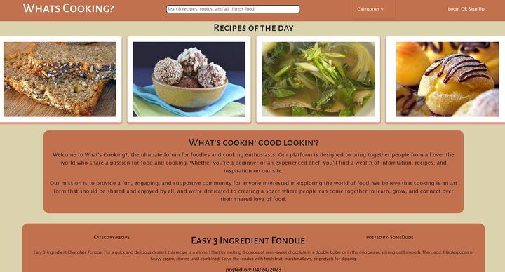

# whats-cooking

## Table of Contents

- [Project Title](#project-title)
- [Description](#description)
- [Installation](#installation)
- [Usage](#usage)
- [License](#license)
- [Contact](#contact)

## Description

Introducing "What's Cooking" - a vibrant online community where
food enthusiasts can discover, share, and discuss their favorite recipes and cooking tips. Our platform connects home cooks,
professional chefs, and everyone in between, creating a space
to inspire and be inspired by culinary creations from around
the world. By harnessing the power of social interaction and
the passion for cooking, "What's Cooking" brings people together, turning everyday meals into memorable experiences.

## Installation

N/A

## Usage

As a new user you can create an account to make posts and become a part of our online community. When you sign up, the user is able to post to the site with a title, body and a category of either recipe, tips or questions. Any user can view the posts from our main dashboard.

## License

N/A

## Contact

- Edson Petry edsonlbpetry@gmail.com
- Austen Tangen atangen2406@gmail.com
- Damian Smith damiansmith61@gmail.com
- Michelle Molokie molokiem@gmail.com
